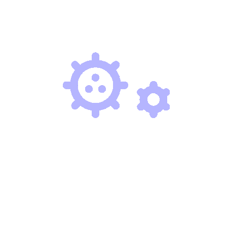
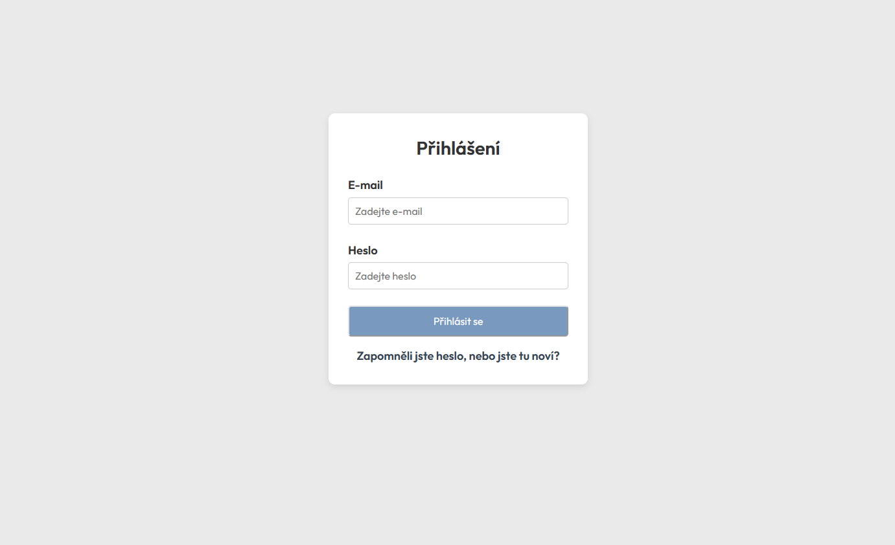
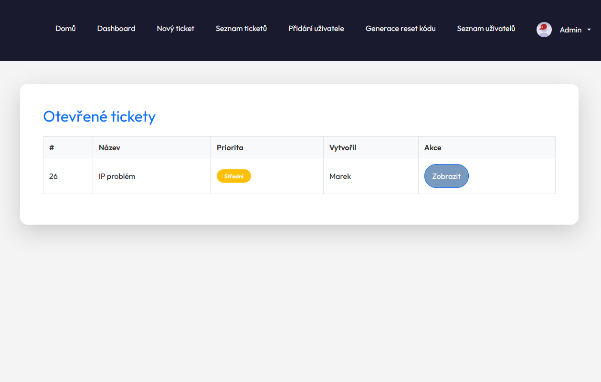
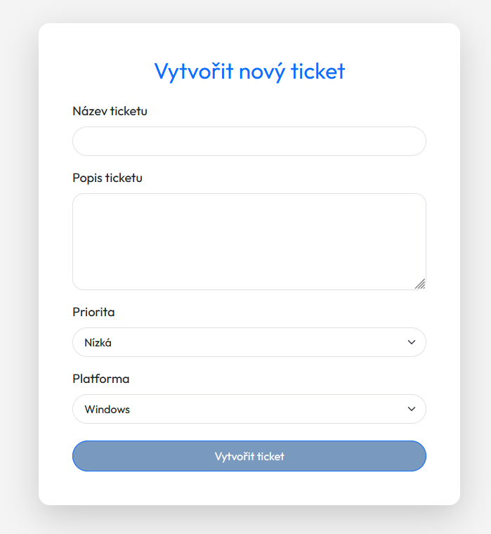
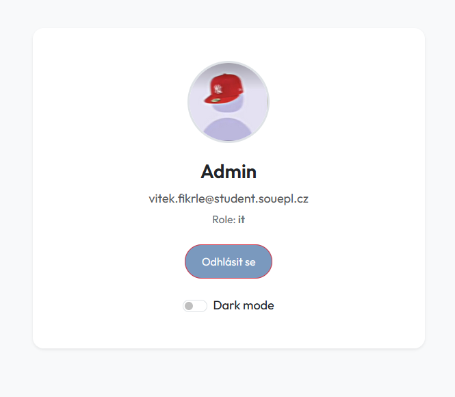

# Send&Solve - Ticketovací nástroj



**Send&Solve** je moderní ticketovací nástroj pro efektivní správu IT požadavků ve školním prostředí. Zaměstnanci mohou snadno nahlásit problémy a IT tým je rychle vyřeší. Frontend je vyvinut v PHP, backend využívá MySQL a design je intuitivní a responzivní.

[](https://opensource.org/licenses/MIT)
[](https://www.php.net/)
[](https://www.mysql.com/)
[](https://getbootstrap.com/)

## 📖 Popis

**Send&Solve** umožňuje zaměstnancům školy s doménou **souepl.cz** vytvářet tickety pro IT problémy, které IT tým spravuje přes přehledné rozhraní. Systém podporuje role (žák, učitel, IT), autentizaci přes e-mail, tmavý režim a export ticketů do Excelu. Aplikace je navržena s důrazem na jednoduchost, přístupnost a škálovatelnost.

## 🎮 Hlavní vlastnosti

- **Vytváření ticketů**: Uživatelé zadávají název, popis, prioritu a platformu.
- **Správa ticketů**: IT tým mění stav (Otevřený, V řešení, Uzavřený) a přidává odpovědi.
- **Historie a komentáře**: Sledování změn a komunikace v ticketech.
- **Export do Excelu**: IT admini mohou exportovat tickety (pouze role IT).
- **Autentizace přes e-mail**: Bezpečné přihlášení a reset hesla přes kódy.
- **Tmavý režim**: Responzivní rozhraní s přepínáním světlého/tmavého režimu.
- **Admin funkce**: Přidávání uživatelů a generování resetovacích kódů (pouze IT).
- **Responzivní design**: Optimalizováno pro mobilní zařízení i desktopy.

## 🛠️ Instalace

1. **Nainstalujte PHP 8.0+ a MySQL**:
   - PHP: [php.net](https://www.php.net/downloads)
   - MySQL: [mysql.com](https://www.mysql.com/downloads/)
2. **Nastavte webový server**:
   - Použijte Apache nebo Nginx.
   - Ujistěte se, že je povolen modul `mysqli`.
3. **Stáhněte repozitář**:
   ```bash
   git clone https://github.com/VitaPhoneCZ/DAD_projekt.git
   ```
   Nebo stáhněte ZIP z GitHubu.
4. **Nastavte databázi**:
   - Vytvořte databázi `dad_db` v MySQL.
   - Importujte schéma (např. `dad_db.sql`, pokud je součástí repozitáře).
   - Upravte připojení v `db.php`:
     ```php
     $host = "localhost";
     $user = "root";
     $pass = ""; // Nastavte bezpečné heslo
     $dbname = "dad_db";
     ```
5. **Zkontrolujte adresářovou strukturu**:
   - Ujistěte se, že adresáře `photo/`, `styles/`, `scripts/`, `components/` a `vendor/` obsahují všechny potřebné soubory (viz adresářová struktura níže).
6. **Nainstalujte závislosti**:
   ```bash
   composer install
   ```
   (Pro PhpSpreadsheet v `vendor/`).

## 🎮 Ovládání a použití

| Funkce                    | Popis                                      |
|---------------------------|--------------------------------------------|
| Přihlášení                | E-mail a heslo na `login.php`.             |
| Vytvoření ticketu         | Vyplňte formulář na `new_ticket.php`.      |
| Správa ticketů            | Zobrazte detaily na `ticket_detail.php`.   |
| Export ticketů (IT)       | Stáhněte Excel na `dashboard.php`.         |
| Přidání uživatele (IT)    | Formulář na `pridat_uzivatele.php`.        |
| Tmavý režim               | Přepněte na `muj-ucet.php` nebo `profile.php`. |
| Odhlášení                 | Klikněte na „Odhlásit se“ v hlavičce.      |

## 🖥️ Požadavky

- **Operační systém**: Windows 10+, Linux (Ubuntu 18.04+), macOS 10.13+.
- **Webový server**: Apache 2.4+ nebo Nginx.
- **PHP**: Verze 8.0 nebo vyšší.
- **MySQL**: Verze 8.0 nebo vyšší.
- **Prohlížeč**: Chrome, Firefox, Edge, Safari (nejnovější verze).
- **Knihovny**: PhpSpreadsheet (v `vendor/`), Bootstrap 5.3, Font Awesome 6.4.
- **Doporučené rozlišení**: 1280x720 nebo vyšší.

## 📸 Screenshoty






## 📂 Adresářová struktura

```
DAD_projekt/
├── components/
│   ├── db.php
│   ├── post_login_header.php
│   ├── login_process.php
│   ├── exporttickets.php
│   ├── pridat_uzivatele.php
│   ├── generate_reset_code.php
│   ├── logout.php
│   ├── toggle_dark_mode.php
│   ├── footer.php
│   ├── header.php
│   └── submit_ticket.php
├── photo/
│   ├── logo.gif
│   ├── it-pfp.jpg
│   ├── ucitel.jpg
│   ├── zak.jpg
│   ├── default.png
│   └── *.png
├── styles/
│   ├── style.css
│   ├── auth.css
│   ├── header.css
│   ├── footer.css
│   └── main.css
├── scripts/
│   ├── script.js
│   └── db.js
├── vendor/
│   └── [Composer závislosti]
├── dashboard.php
├── forgot-password.php
├── generate_reset_code.php
├── index.php
├── login.php
├── muj-ucet.php
├── new_ticket.php
├── pridat_uzivatele.php
├── tickets.php
├── ticket_detail.php
└── users.php
```

## 🔄 Procesy

- **Vytváření ticketu**: Uživatel vyplní formulář (`new_ticket.php`), ticket se uloží do databáze a zobrazí v seznamu (`tickets.php`).
- **Přiřazování a eskalace**: IT tým (role `it`) spravuje tickety přes `ticket_detail.php`, mění stavy a přidává odpovědi.
- **Reset hesla**: Uživatelé mohou požádat o resetovací kód (`forgot-password.php`, `generate_reset_code.php`).
- **Správa uživatelů**: IT admini přidávají uživatele (`pridat_uzivatele.php`) a spravují seznam (`users.php`).

## 📝 UX a UI

- **Design**: Intuitivní rozhraní s Bootstrap 5 a Font Awesome ikonami.
- **Přístupnost**: Responzivní design, podpora tmavého režimu, dotykově přátelské prvky (min. 44px).
- **Mobilní optimalizace**: Skrytí nepotřebných sloupců v tabulkách, mobilní navigace.

## 🎯 Testování a nasazení

- **Testovací plán**: Funkční testy přihlášení, vytváření ticketů, exportu a správy uživatelů.
- **Nasazení**: Implementace na školní server, školení zaměstnanců.
- **Pravidelné testy**: Kontrola kompatibility s novými verzemi PHP a MySQL.

## 🛠️ Podpora a údržba

- **Údržba**: Pravidelné aktualizace závislostí (`composer update`).
- **Podpora**: IT tým dostupný přes tickety nebo e-mail (it@souepl.cz).
- **Zálohování**: Pravidelné zálohy databáze `dad_db`.

## 👥 Tým Problem Fixers

- **Roman** – Dokumentace
- **Dáša** – Frontend
- **Vítek** – Backend (manažer)
- **Šimon** – Design (manažer)
- **Vašek** – Sekretářka

**Cílová skupina**: Zaměstnanci školy s doménou **souepl.cz**, zejména učitelé, žáci a IT pracovníci.

## 🔗 Odkazy

- **Repozitář**: [github.com/VitaPhoneCZ/DAD_projekt](https://github.com/VitaPhoneCZ/DAD_projekt)
- **Demo**: [HomeServer](https://vitaphone.vlastas.cc/dad/) [Endora](https://problemfixers.jednoduse.cz/)

## 🙏 Poděkování

Děkujeme týmu **Problem Fixers** za tvrdou práci a všem zaměstnancům školy, kteří poskytli zpětnou vazbu! Inspirací nám byly open-source projekty a potřeby školního IT prostředí.

---

**⚡ Problem Fixers – Fixujeme problémy, ne lidi!**  
⭐ **Líbí se vám Send&Solve? Dejte nám hvězdičku na GitHubu!** ⭐